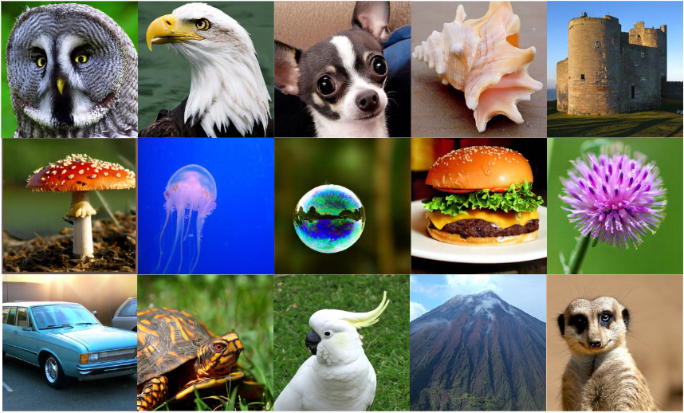

<!-- # DiP: Taming Diffusion Models in Pixel Space -->

<h1> DiP: Taming Diffusion Models in Pixel Space </h1>

Our code will be released soon... 🚀🚀🚀

<table class="center">
  <tr>
    <td width=100% style="border: none"></td>
  </tr>
</table>

Diffusion models face a fundamental trade-off between generation quality and computational efficiency. Latent Diffusion Models (LDMs) offer an efficient solution but suffer from potential information loss and non-end-to-end training. In contrast, existing pixel space models bypass VAEs but are computationally prohibitive for high-resolution synthesis. To resolve this dilemma, we propose DiP, an efficient pixel space diffusion framework. DiP decouples generation into a global and a local stage: a Diffusion Transformer (DiT) backbone operates on large patches for efficient global structure construction, while a co-trained lightweight Patch Detailer Head leverages contextual features to restore fine-grained local details. This synergistic design achieves computational efficiency comparable to LDMs without relying on a VAE. DiP is accomplished with up to 10x faster inference speeds than previous method while increasing the total number of parameters by only 0.3\%, and achieves an 1.79 FID score on ImageNet 256x256. 