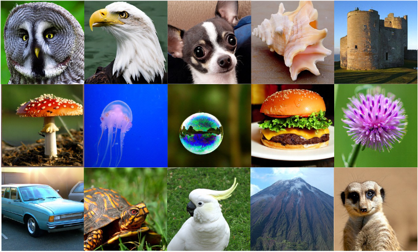

# DiP: Taming Diffusion Models in Pixel Space


<div style="text-align: center;">
  <a href="https://arxiv.org/abs/2511.18822"></a>
  <table class="center">
  <tr>
    <td width=100% style="border: none"></td>
  </tr>
</table>
</div>

## Introduction
Diffusion models face a fundamental trade-off between generation quality and computational efficiency. Latent Diffusion Models (LDMs) offer an efficient solution but suffer from potential information loss and non-end-to-end training. In contrast, existing pixel space models bypass VAEs but are computationally prohibitive for high-resolution synthesis. To resolve this dilemma, we propose DiP, an efficient pixel space diffusion framework. DiP decouples generation into a global and a local stage: a Diffusion Transformer (DiT) backbone operates on large patches for efficient global structure construction, while a co-trained lightweight Patch Detailer Head leverages contextual features to restore fine-grained local details. This synergistic design achieves computational efficiency comparable to LDMs without relying on a VAE. DiP is accomplished with up to 10x faster inference speeds than previous method while increasing the total number of parameters by only 0.3%, and achieves an 1.79 FID score on ImageNet 256x256.


## Checkpoints

| Dataset     | Model     | Params | HuggingFace |
|-------------|-----------|--------|-------------|
| ImageNet256 | DiP-XL/16 | 631M  | [🤗](https://huggingface.co/zhen-nan/DiP)          |

For higher-resolution applications, please refer to [L2P](https://github.com/TencentYoutuResearch/T2I-L2P).

## Usages
We use the ADM evaluation suite to report FID on ImageNet.


```bash
# for training
python main.py fit -c configs_c2i/dip_xl.yaml
```

```bash
# for inference (multi-GPU)
CUDA_VISIBLE_DEVICES=0,1,2,3,4,5,6,7 python main.py predict \
    -c configs_c2i/dip_xl.yaml --ckpt_path=/path/to/model.ckpt

# or single-GPU
CUDA_VISIBLE_DEVICES=0 python main.py predict \
    -c configs_c2i/dip_xl.yaml --ckpt_path=/path/to/model.ckpt
```

## Citation
If you find this work useful for your research, please consider citing:

```bibtex
@article{chen2025dip,
  title   = {DiP: Taming Diffusion Models in Pixel Space},
  author  = {Chen, Zhennan and Zhu, Junwei and Chen, Xu and Zhang, Jiangning and Hu, Xiaobin and Zhao, Hanzhen and Wang, Chengjie and Yang, Jian and Tai, Ying},
  journal = {arXiv preprint arXiv:2511.18822},
  year    = {2025}
}
```

## Acknowledgement
The code is mainly built upon [PixNerd](https://github.com/MCG-NJU/PixNerd), [REPA](https://github.com/sihyun-yu/REPA), and [DiT](https://github.com/facebookresearch/DiT).